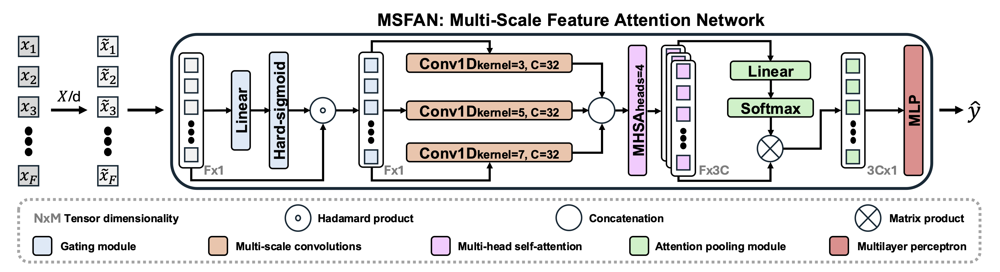

# Multi-Scale Feature Attention Network

### TL;DR

Reliable polymer identification is essential for ensuring the quality and safety of recycled plastics, yet conventional sorting and spectroscopic techniques often struggle to deliver robust discrimination. Terahertz (THz) spectroscopy offers a promising alternative, providing high-resolution and non-destructive measurements. In this work, we leverage THz signals to classify 12 types of polymers, including pure polymers, multilayer films, commercial blends, and biopolymers.

To handle the complexity of these spectral signals, we propose the Multi-Scale Feature Attention Network (MSFAN), a novel deep learning architecture tailored for THz data. MSFAN integrates:

- **Feature gating** for adaptive signal recalibration
- **Multi-scale parallel convolutions** to capture complementary frequency patterns
- **Cross-feature attention** to model interdependencies
- **Attention pooling** to emphasize the most informative spectral regions

MSFAN consistently outperforms state-of-the-art models, reaching a classification accuracy of 85.2%. This study demonstrates the potential of combining THz spectroscopy with deep learning techniques for effective, scalable, and interpretable polymer classification.

<p align="center">
  
</p>

*<a href="https://scholar.google.es/citations?user=pHIFUSkAAAAJ&hl=es" style="color:blue;">Roshni Mahtani</a>,
<a href="https://scholar.google.com/citations?user=N8Y3mGAAAAAJ&hl=es" style="color:blue;">Ilán Carretero</a>,
<a href="https://scholar.google.es/citations?hl=es" style="color:blue;">Daniel Moreno-Paris</a>,
<a href="https://scholar.google.es/citations?hl=es" style="color:blue;">Aldo Moreno-Oyervides</a>,
<a href="https://www.linkedin.com/in/laura-monroy-lasers/" style="color:blue;">Laura Monroy</a>,
<a href="https://scholar.google.es/citations?hl=es" style="color:blue;">Oscar Elías Bonilla-Manrique</a>,
<a href="https://scholar.google.com/citations?user=CPCZPNkAAAAJ&hl=es" style="color:blue;">Rocío del Amor</a>*

📜 <span style="color:red"><em>Submitted to <a href="https://eusipco2026.org" style="color:red;">EUSIPCO'26</a></em></span> 


---

## PROJECT STRUCTURE

```text
.
├── data/                      # Input datasets
│   ├── *.csv                    # Spectral data (HG, LG), divided by thickness or not
│
├── figures/                   # Figures used in the paper
│
├── outputs/                   # Results of MSFAN and its ablations
│
├── src/                       # Source code
│   ├── data_loader.py           # Functions for loading and preprocessing THz data
│   ├── losses.py                # Custom loss functions
│   ├── main.py                  # Main training / evaluation script
│   ├── models.py                # MSFAN architecture and variants
│   ├── utils.py                 # Utilities: experiment helpers, metrics, table generation
│
├── requirements.txt           # Python dependencies
├── run_best_model.py          # Script to train / evaluate the final MSFAN model
├── run_ablations.py           # Script to run ablation studies: aggregation, modules, l1

```

---

## INSTALLATION AND USAGE

### 1. Runtime Environment

The project was developed and tested in the official NVIDIA container:

- Docker Image: nvcr.io/nvidia/pytorch:23.10-py3

You can launch the environment with Docker, mount the project folder, and access the container to run the scripts.

Install the required dependencies with:

    pip install -r requirements.txt

---

### 2. Training the Best Model

Run the full MSFAN model:

    python run_best_model.py

All outputs, including metrics and figures, will be stored in the `outputs/` folder.

---

### 3. Running Ablation Studies

Run a specific ablation study with:

    python run_ablations.py --ablation <type>

Where `<type>` can be:

- **aggregation**: Tests different aggregation strategies: hg_only, lg_only, mean, max, concat, dual
- **modules**: Tests MSFAN components individually (pooling only, gating only, conv only, attention only) and removals  
- **l1**: Tests the effect of the L1 sparsity weight

All outputs, including metrics and figures, will be stored in the `outputs/` folder.

---

We acknowledge the authors of *Deep learning-based plastic classification using spectroscopic data* for providing both the baseline implementations and the reference model used for comparison in this work.
Their code is publicly available at: [https://github.com/aruMMG/PLASTIC](https://github.com/aruMMG/PLASTIC).

The raw THz dataset employed in this study is openly accessible at:
[https://github.com/danimp94/PLASTICS-THz](https://github.com/danimp94/PLASTICS-THz/tree/main/data/experiment_5_plastics).

We sincerely thank the authors for supporting open and reproducible research.